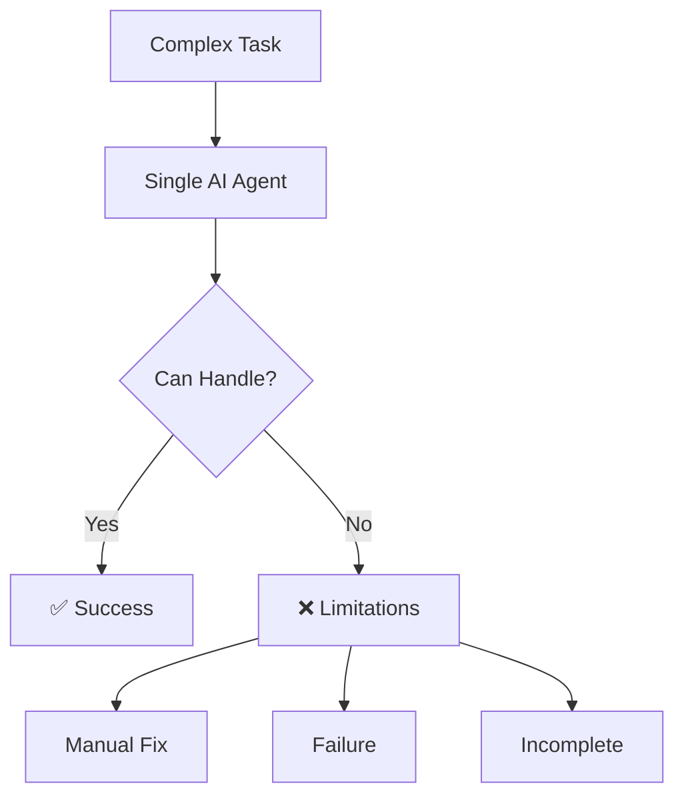
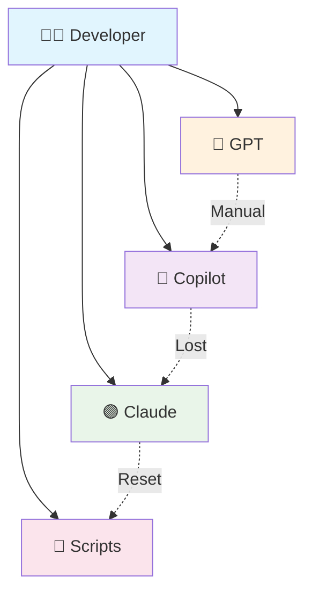
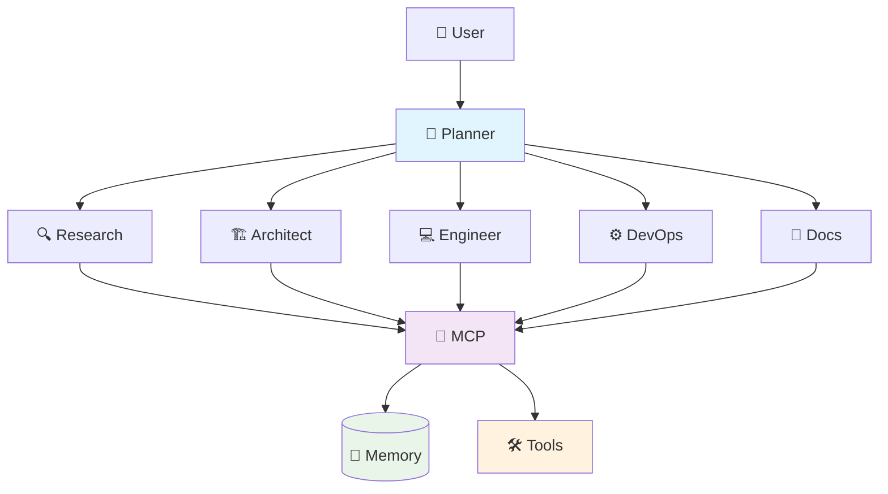
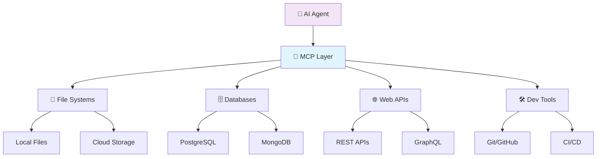

# AgentCrew

## Multi-Agent AI Orchestration Framework

<div class="pt-12">
  <span @click="$slidev.nav.next" class="px-2 py-1 rounded cursor-pointer" hover="bg-white bg-opacity-10">
    Transforming AI Collaboration <carbon:arrow-right class="inline"/>
  </span>
</div>

<div class="abs-br m-6 flex gap-2">
  <button @click="$slidev.nav.openInEditor()" title="Open in Editor" class="text-xl slidev-icon-btn opacity-50 !border-none !hover:text-white">
    <carbon:edit />
  </button>
  <a href="https://github.com/AgentCrew" target="_blank" alt="GitHub" title="Open in GitHub"
    class="text-xl slidev-icon-btn opacity-50 !border-none !hover:text-white">
    <carbon-logo-github />
  </a>
</div>

<!--
Welcome to the AgentCrew presentation! Today we'll explore how multi-agent AI systems are revolutionizing the way we approach complex technical challenges.

This presentation will take you through:
- The fundamental problems AgentCrew solves
- Core architecture and capabilities
- Real-world applications and benefits
-->

---
layout: center
class: text-center
---

# Today's Journey

<div class="grid grid-cols-2 gap-8 pt-8">

<div class="space-y-4">

## 🎯 **Problem & Solution**

<div class="text-sm opacity-75">
Understanding the multi-agent challenge
</div>

## 🏗️ **Architecture Deep Dive**

<div class="text-sm opacity-75">
Core features and capabilities
</div>

</div>

<div class="space-y-4">

## 🚀 **Live Demonstration**

<div class="text-sm opacity-75">
See AgentCrew in action
</div>

## 💡 **Q&A & Discussion**

<div class="text-sm opacity-75">
Your questions answered
</div>

</div>

</div>

<style>
h2 {
  background-color: #2B90B6;
  background-image: linear-gradient(45deg, #4EC5D4 10%, #146b8c 20%);
  background-size: 100%;
  -webkit-background-clip: text;
  -moz-background-clip: text;
  -webkit-text-fill-color: transparent;
  -moz-text-fill-color: transparent;
}

/* Prevent text overflow */
.slidev-layout {
  overflow: hidden;
}

/* Ensure code blocks fit */
pre {
  font-size: 0.85em !important;
  overflow-x: auto;
  max-width: 100%;
}

/* Responsive grid adjustments */
.grid {
  gap: 1rem !important;
}

/* Mermaid diagram scaling */
.mermaid {
  max-width: 100% !important;
  height: auto !important;
}
</style>

<!--
Our agenda today covers four key areas:

1. First, we'll establish the problem space and how AgentCrew provides a solution
2. Then dive deep into the architecture and technical capabilities
3. See a live demonstration of the framework in action
4. Finally, open discussion for your questions

Let's begin with understanding the challenge that led to AgentCrew's creation.
-->

---
layout: default
---

# 🎯 The Challenge We Face

<div class="grid grid-cols-2 gap-8">

<div>

## **Complex Tasks = Multiple Specializations**

<v-clicks>

- 🔍 **Research** → Data gathering & analysis
- 💻 **Development** → Code implementation
- 🏗️ **Architecture** → System design
- 📊 **DevOps** → Infrastructure management
- 📝 **Documentation** → Technical writing

</v-clicks>

</div>

<div v-click="6">

## **Current AI Limitations**



</div>

</div>

<div v-click="7" class="mt-8 p-4 bg-red-50 border-l-4 border-red-400 dark:bg-red-900/20">
<h3 class="text-red-700 dark:text-red-300">💡 The Problem</h3>

**Single agents hit walls** → **Fragmented workflows** → **Inefficient outcomes**

</div>

<!--
Let's start by understanding the fundamental challenge in AI assistance today.

Modern technical work requires multiple specializations - from research and development to architecture and documentation. Each domain has its own complexity, tools, and best practices.

Current AI systems typically use single agents that try to handle everything. While impressive, they inevitably hit limitations when faced with multi-step workflows that require different types of expertise.

This leads to fragmented workflows, manual intervention, and often incomplete results. We need a better approach.
-->

---
layout: default
---

# **Scattered Tools & Inconsistent Interfaces**

<div class="grid grid-cols-2 gap-8">

<div>

## **Current Reality**

<v-clicks>

- 🔧 **Multiple Tools**
  - ChatGPT for queries
  - GitHub Copilot for code
  - Claude for analysis
  - Custom automation

- 🔄 **Context Switching**
  - Manual data transfer
  - Repeated explanations
  - Lost conversation history
  - Fragmented workflows

</v-clicks>

</div>

<div v-click="3">

## **The Coordination Problem**



</div>

</div>

<div v-click="4" class="mt-8 p-4 bg-orange-50 border-l-4 border-orange-400 dark:bg-orange-900/20">
<h3 class="text-orange-700 dark:text-orange-300">⚡ The Solution Needed</h3>

**Unified coordination** → **Shared context** → **Seamless workflows**

</div>

<!--
Beyond individual agent limitations, we face a broader coordination problem.

In today's reality, developers juggle multiple AI tools - ChatGPT for general queries, GitHub Copilot for coding, Claude for analysis, plus various custom scripts for automation.

This creates significant overhead:
- Constant context switching between tools
- Manual data transfer between systems
- Repeated explanations as context is lost
- Fragmented workflows that break concentration

The diagram shows how information flows (or fails to flow) between these disconnected tools. Each transition loses context and requires manual intervention.

What we need is unified coordination with shared context to enable truly seamless workflows.
-->

---
layout: center
class: text-center
---

# **What is AgentCrew?**

<div v-click="1" class="text-6xl mb-8">🤖🤝🤖</div>

<div v-click="2">

## **Multi-Agent AI Assistant Framework**

<div class="grid grid-cols-3 gap-6 mt-12">

<div class="text-center">
<div class="text-3xl mb-4">👥</div>
<h3>Specialist Agents</h3>
<p class="text-sm opacity-75">Each with focused expertise</p>
</div>

<div class="text-center">
<div class="text-3xl mb-4">🔗</div>
<h3>Seamless Coordination</h3>
<p class="text-sm opacity-75">Intelligent task delegation</p>
</div>

<div class="text-center">
<div class="text-3xl mb-4">🌐</div>
<h3>Provider Agnostic</h3>
<p class="text-sm opacity-75">Works with any AI model</p>
</div>

</div>

</div>

<div v-click="3" class="mt-12 text-xl font-semibold text-blue-600 dark:text-blue-400">
Open Source Solution for AI Orchestration
</div>

<!--
AgentCrew is our answer to these challenges.

At its core, AgentCrew is a multi-agent AI assistant framework that enables specialist agents to work together seamlessly. Think of it as assembling an expert team where each member has deep knowledge in their domain.

The key differentiators are:
- Specialist agents with focused expertise
- Seamless coordination through intelligent task delegation
- Provider-agnostic architecture that works with any AI model

And it's completely open source, making advanced AI orchestration accessible to everyone.

Now let's dive into how this actually works under the hood.
-->

---
layout: section
---

# 🏗️ Core Architecture & Features

---
layout: two-cols
---

# **Multi-Agent System Design**

<div class="space-y-6">

## **🎭 Role-Based Specialization**

<v-clicks>

- **Research Agent** → Information gathering
- **Development Agent** → Code implementation
- **Architecture Agent** → System design
- **DevOps Agent** → Infrastructure
- **Documentation Agent** → Technical writing

</v-clicks>

<div v-click="6" class="mt-8">

## **🔄 Smart Coordination**

- Context-aware task delegation
- Seamless agent handoffs
- Shared memory and state

</div>

</div>

::right::

<div v-click="7">



</div>

<!--
The architecture is built around role-based specialization. Each agent has deep expertise in their domain - research, development, architecture, DevOps, and documentation.

The magic happens in the coordination layer. A PlannerAgent analyzes incoming requests and intelligently delegates tasks to the appropriate specialists.

The Model Context Protocol (MCP) serves as the communication backbone, enabling:
- Standardized messaging between agents
- Shared memory for maintaining context
- Unified access to the tool ecosystem

This creates a system where agents can work independently while staying perfectly coordinated.
-->

---
layout: default
---

# **🔌 Tools and Model Context Protocol (MCP)**

<div class="grid grid-cols-2 gap-8">

<div>

## **What are MCP Servers?**

<v-clicks>

- 🔌 **Model Context Protocol (MCP)** - Open standard by Anthropic
- 🌉 **Bridge between AI models and external tools**
- 📦 **Standardized server implementations** for different services
- 🔒 **Secure, controlled access** to local and remote resources
- 🛠️ **Tool discovery and invocation** through unified interface

</v-clicks>

<div v-click="6" class="mt-4 p-3 bg-blue-50 border-l-4 border-blue-400 dark:bg-blue-900/20">
<h4 class="text-blue-700 dark:text-blue-300 text-sm">💡 Think of MCP as...</h4>
<div class="text-xs mt-1">A universal translator that lets AI agents safely talk to databases, APIs, file systems, and more through a common language</div>
</div>

</div>

<div v-click="7">

## **MCP Ecosystem**



</div>

</div>

---
layout: default
---

# **🌟 Awesome MCP Servers**

<div class="text-xs mb-4 opacity-75">Source: <a href="https://github.com/punkpeye/awesome-mcp-servers" target="_blank">github.com/punkpeye/awesome-mcp-servers</a> (62k+ stars)</div>

<div class="grid grid-cols-3 gap-4 text-xs">

<div>

### **📂 File Systems & Cloud**
- **Local Files** - Direct file system access
- **Google Drive** - Cloud file management
- **AWS S3** - Object storage
- **Box/Dropbox** - Cloud sync platforms

### **🗄️ Databases**
- **PostgreSQL/MySQL** - Relational databases
- **MongoDB** - NoSQL document store
- **Redis** - In-memory cache
- **BigQuery/Snowflake** - Data warehouses

</div>

<div>

### **🔄 Development & DevOps**
- **GitHub/GitLab** - Code repositories
- **Docker** - Container management
- **Kubernetes** - Orchestration
- **Jira/Linear** - Project management

### **🌐 Communication**
- **Slack/Teams** - Team messaging
- **Gmail/Outlook** - Email systems
- **Telegram/Discord** - Chat platforms
- **Notion** - Documentation

</div>

<div>

### **🔍 Search & Analytics**
- **Google Search** - Web search
- **Brave Search** - Private search
- **Elasticsearch** - Full-text search
- **Grafana** - Monitoring dashboards

### **🤖 AI & ML Services**
- **OpenAI** - GPT models
- **Anthropic** - Claude models
- **Vector Databases** - Embeddings
- **HuggingFace** - ML models

</div>

</div>

<div v-click="1" class="mt-6 p-4 bg-green-50 border-l-4 border-green-400 dark:bg-green-900/20">
<h3 class="text-green-700 dark:text-green-300 text-sm">🚀 3,000+ Pre-built Servers Available</h3>
<div class="text-xs mt-1">From file systems to AI services - if it has an API, there's likely an MCP server for it</div>
</div>

---
layout: default
---

# **🛠️ AgentCrew's Available Tools**

<div>

## **Core Built-in Tools**

<v-clicks>

- 🔍 **Web Search** - Real-time information gathering via Brave/Tavily
- 📋 **Clipboard Access** - Read/write system clipboard
- 🧠 **Memory Management** - Persistent conversation context
- 📊 **Code Analysis** - Repository understanding & insights

</v-clicks>

</div>

---
layout: default
---

# **🚀 YOLO Mode (You Only Live Once)**

## **⚡ Autonomous Execution**

- ⚡ **No Approval Dialogs** - Agents execute tools immediately
- 🎯 **Uninterrupted Workflow** - Agents work without human intervention
- 🏃 **Maximum Speed** - Rapid tool chaining and execution
- 🔧 **Developer Mode** - Perfect for trusted development environments


---
---
## **🛡️ Safety Considerations**

<div class="space-y-4">

**Required Conditions:**
- 🔐 **Trusted Environment Only**
- 👤 **Authenticated Users**
- 🏢 **Controlled Infrastructure**

**Built-in Safeguards:**
- 📝 **Complete Audit Logs** - All actions tracked
- 🛑 **Emergency Stop** - Immediate termination capability
- 🎛️ **Configurable Limits** - Resource and scope boundaries
- 🔍 **Real-time Monitoring** - Action visibility

</div>

<div class="mt-8 p-4 bg-yellow-50 border-l-4 border-yellow-400 dark:bg-yellow-900/20">
<h3 class="text-yellow-700 dark:text-yellow-300">⚖️ Balance: Power vs Control</h3>
<div class="text-sm mt-1">YOLO mode offers maximum efficiency but requires careful consideration of security implications</div>
</div>

---
layout: default
---

# **⚡ Tool Approval Mode**

## **🛡️ Default: Tool Approval Mode**

- 🔒 **User Control** - Manual approval for each tool call
- 📋 **Approval Dialog** - Shows tool name, purpose, and parameters
- ✅ **Granular Decisions** - Approve once, always, or deny
- 🔄 **Persistent Memory** - Remembers approved tools per session
- 🚨 **Safety First** - Prevents unintended actions

## **✨ Key Benefits:**
- 🎯 **Granular Control** over agent actions
- 📊 **Audit Trail** for all decisions
- 🛡️ **Security** by default

---
layout: default
---

# **🤖 AI Provider Support**

<div class="grid grid-cols-3 gap-4">

<div v-click="1" class="text-center p-3 border-2 border-blue-200 rounded-lg dark:border-blue-800">
<div class="text-2xl mb-2">🟢</div>
<h3 class="text-sm mb-2">**OpenAI**</h3>
<div class="text-xs space-y-0.5">
<div>GPT-3.5 • GPT-4</div>
<div>GPT-4 Turbo • GPT-4o</div>
</div>
</div>

<div v-click="2" class="text-center p-3 border-2 border-purple-200 rounded-lg dark:border-purple-800">
<div class="text-2xl mb-2">🟣</div>
<h3 class="text-sm mb-2">**Anthropic**</h3>
<div class="text-xs space-y-0.5">
<div>Claude 3 Haiku</div>
<div>Claude 3.5 Sonnet</div>
</div>
</div>

<div v-click="3" class="text-center p-3 border-2 border-yellow-200 rounded-lg dark:border-yellow-800">
<div class="text-2xl mb-2">🔵</div>
<h3 class="text-sm mb-2">**Google**</h3>
<div class="text-xs space-y-0.5">
<div>Gemini Pro</div>
<div>Gemini Flash</div>
</div>
</div>

</div>

<div class="grid grid-cols-2 gap-4 mt-6">

<div v-click="4" class="text-center p-3 border-2 border-gray-200 rounded-lg dark:border-gray-800">
<div class="text-2xl mb-2">🐙</div>
<h3 class="text-sm mb-2">**GitHub Copilot**</h3>
<div class="text-xs">Enterprise integration</div>
</div>

<div v-click="5" class="text-center p-3 border-2 border-green-200 rounded-lg dark:border-green-800">
<div class="text-2xl mb-2">🔧</div>
<h3 class="text-sm mb-2">**Provider Agnostic**</h3>
<div class="text-xs">Pluggable architecture</div>
</div>

</div>

<div v-click="6" class="mt-6 p-3 bg-green-50 border-l-4 border-green-400 dark:bg-green-900/20">
<h3 class="text-green-700 dark:text-green-300 text-sm">✨ Smart Model Selection</h3>
<div class="text-xs mt-1">Agents automatically choose the **optimal model** for each task type and complexity</div>
</div>

<!--
One of AgentCrew's major strengths is its provider-agnostic architecture. You're not locked into any single AI provider.

The framework supports all major providers - OpenAI's GPT family, Anthropic's Claude models, Google's Gemini, and even GitHub Copilot for enterprise scenarios.

But here's the key advantage: agents can automatically select the optimal model for each specific task. A research agent might use GPT-4 for complex analysis, while a code generation task might leverage Claude 3.5 Sonnet for its superior coding capabilities.

This flexibility ensures you always get the best performance while managing costs effectively.
-->

---
layout: default
---

# **🧠 Adaptive Behaviors System**

<div>

## **"when...do..." Rule System**

```yaml {1-2|4-6|8-10|12-14}
# User preference adaptation
when: user mentions "deadline"
do: prioritize speed over details

# Technical context awareness  
when: user asks about "code"
do: provide complete examples
    include syntax highlighting

# Communication style learning
when: user prefers "visual"
do: include diagrams

# Domain-specific behaviors
when: user works with "kubernetes"
do: suggest kubectl commands
```

</div>

<!--
The adaptive behaviors system is what makes AgentCrew truly intelligent over time. It learns from your interactions and adapts to your working style.

The system uses a simple but powerful "when...do..." rule format. For example:
- When you mention deadlines, it prioritizes speed
- When you ask about code, it provides complete executable examples
- When you prefer visual explanations, it includes diagrams

These behaviors cover three main categories:
- User preferences for communication and detail
- Task patterns for recurring workflows
- Context triggers for situational awareness

The system continuously learns and refines these behaviors, making each interaction more efficient than the last.
-->

---
layout: default
---

# **📚 Learning Categories**

<div>

## **🧠 What Agents Learn About You**

<div class="grid grid-cols-3 gap-6 mt-6">

<div v-click="1">

### **🎯 User Preferences**
- Communication style preferences
- Level of detail you prefer
- Interaction patterns and habits

</div>

<div v-click="2">

### **📝 Task Patterns**
- Recurring workflows you use
- Domain-specific needs
- Tool preferences and shortcuts

</div>

<div v-click="3">

### **🔄 Context Triggers**
- Environmental awareness
- Situational adaptations
- Project-specific behaviors

</div>

</div>

</div>

<div v-click="5" class="mt-6 p-4 bg-blue-50 border-l-4 border-blue-400 dark:bg-blue-900/20">
<h3 class="text-blue-700 dark:text-blue-300">💡 Continuous Improvement</h3>
<div class="text-sm mt-1">Each interaction teaches agents to work better with your unique style and requirements</div>
</div>

<!--
The learning categories system helps agents understand and adapt to your working style across multiple dimensions.

User preferences cover how you like to communicate - whether you prefer detailed explanations or quick summaries, visual aids or text-based responses, and your general interaction patterns.

Task patterns involve understanding your recurring workflows, domain-specific needs, and tool preferences. This helps agents anticipate what you'll need and streamline common operations.

Context triggers allow agents to be environmentally aware - adapting based on the project you're working on, the time of day, or situational factors that affect how you work.

The real-time adaptation example shows how this works in practice - when you mention performance, agents learn to automatically include benchmarks and metrics in their responses.

This continuous learning ensures that each interaction is more efficient and tailored than the last.
-->

---
layout: default
---

## **Permission Controls**

<v-clicks>

- 🔒 **Granular Permissions**
  - Tool-specific access control
  - Risk-based approval workflows
  - User-defined safety boundaries

- 📊 **Audit Trail**
  - Complete action logging
  - Decision tracking
  - Compliance reporting

- ⚡ **Smart Automation**
  - Low-risk auto-approval
  - Pattern-based trust
  - Emergency stop capabilities

</v-clicks>

<div v-click="4" class="mt-8 p-4 bg-yellow-50 border-l-4 border-yellow-400 dark:bg-yellow-900/20">
<h3 class="text-yellow-700 dark:text-yellow-300">🛡️ Safety First</h3>

**You remain in control** - agents request permission for sensitive operations

</div>

<!--
Safety and user control are paramount in AgentCrew's design. While agents are intelligent and autonomous, you always maintain ultimate control.

The tool approval system categorizes actions by risk level. Low-risk operations like reading files can be auto-approved, while high-risk operations like system modifications require explicit user confirmation.

The permission system provides:
- Granular control over what each agent can do
- Complete audit trails for compliance and debugging
- Smart automation that learns your approval patterns

The key principle is that you remain in control. Agents will request permission for sensitive operations, explain their reasoning, and respect your boundaries.

This ensures powerful automation without sacrificing safety or oversight.
-->

---
layout: two-cols
---

# **💻 Dual Interfaces**

## **Console Interface**

<div class="space-y-4">

<v-clicks>

- 🖥️ **Command-line power**
- ⚡ **Rapid interaction**
- 🔧 **Scriptable workflows**
- 🎯 **Developer-friendly**

</v-clicks>

</div>

::right::

<div v-click="6">

## **GUI Interface**

<div class="space-y-4">

- 👁️ **Visual monitoring**
- 📊 **Real-time dashboards**
- 🎮 **Interactive controls**
- 📱 **User-friendly experience**

</div>

</div>

<!--
AgentCrew provides dual interfaces to accommodate different user preferences and use cases.

The console interface is perfect for power users and developers who prefer command-line efficiency. You can rapidly interact with agents, script workflows, and integrate with existing terminal-based development environments.

The GUI interface provides visual monitoring with real-time dashboards, interactive controls, and a more user-friendly experience for those who prefer graphical interfaces.

Both interfaces provide the same underlying functionality - it's about choosing the interaction style that fits your workflow best.

This flexibility ensures AgentCrew adapts to how you work, rather than forcing you to adapt to it.
-->

---
layout: center
class: text-center
---

# **Architecture Summary**

<div class="grid grid-cols-2 gap-12 mt-8">

<div class="text-left">

## **🏗️ Foundation**

- Multi-agent specialization
- MCP communication layer
- Provider-agnostic design
- Adaptive behavior learning

</div>

<div class="text-left">

## **🚀 Capabilities**

- Comprehensive tool ecosystem
- User control & safety
- Dual interface options
- Seamless coordination

</div>

</div>

<div class="mt-12 text-2xl font-semibold text-blue-600 dark:text-blue-400">
**Next: See AgentCrew in Action** 🎬
</div>

<!--
Let's summarize what we've covered about AgentCrew's architecture.

The foundation is built on multi-agent specialization with the MCP communication layer, provider-agnostic design, and adaptive behavior learning.

The capabilities include a comprehensive tool ecosystem, user control and safety mechanisms, dual interface options, and seamless coordination between agents.

This architecture creates a framework that's both powerful and practical - capable of handling complex technical workflows while remaining safe and user-controlled.

Now that we understand how AgentCrew works, let's see it in action with a live demonstration.
-->

---
layout: end
---

# Thank You!

## **Questions & Discussion**

<div class="grid grid-cols-2 gap-8 mt-12 text-left">

<div>

### 🔗 **Resources**

- Website: `agentcrew.dev`
- GH: `github.com/saigontechnology/AgentCrew`

</div>

<div>

### 💬 **Let's Discuss**

- Implementation questions
- Use case scenarios
- Architecture deep dives
- Contributing opportunities

</div>

</div>

<!--
Thank you for your attention!

I hope this overview of AgentCrew has shown you the potential of multi-agent AI orchestration. The combination of specialized agents, intelligent coordination, and comprehensive tool integration opens up exciting possibilities for technical workflows.

We have resources available for further exploration, including comprehensive documentation, the open-source codebase on GitHub, and an active community on Discord.

Now I'd love to hear your questions and discuss:
- Any implementation questions you might have
- Specific use case scenarios you're considering
- Architecture details you'd like to explore further
- Opportunities for contributing to the project

What questions do you have about AgentCrew?
-->

---

<style>
/* Global styles to prevent overflow */
.slidev-layout {
  padding: 1rem !important;
  overflow: hidden;
}

.slidev-layout h1 {
  font-size: 2.5rem !important;
  line-height: 1.2 !important;
  margin-bottom: 1rem !important;
}

.slidev-layout h2 {
  font-size: 1.8rem !important;
  line-height: 1.3 !important;
  margin-bottom: 0.8rem !important;
}

.slidev-layout h3 {
  font-size: 1.4rem !important;
  line-height: 1.3 !important;
  margin-bottom: 0.6rem !important;
}

/* Code block improvements */
.slidev-layout pre {
  font-size: 0.75rem !important;
  line-height: 1.4 !important;
  overflow-x: auto;
  max-width: 100%;
  margin: 0.5rem 0 !important;
}

.slidev-layout code {
  font-size: 0.8rem !important;
  word-break: break-word;
}

/* Grid responsiveness */
.grid {
  gap: 0.75rem !important;
}

.grid-cols-2 > div {
  min-width: 0; /* Allows flex items to shrink */
}

.grid-cols-3 > div {
  min-width: 0;
}

/* Text size adjustments */
.text-sm {
  font-size: 0.8rem !important;
}

.text-xs {
  font-size: 0.7rem !important;
}

/* Mermaid diagrams */
.mermaid svg {
  max-width: 100% !important;
  height: auto !important;
}

/* Prevent content overflow */
.space-y-4 > * + * {
  margin-top: 0.75rem !important;
}

.space-y-6 > * + * {
  margin-top: 1rem !important;
}

/* List item spacing */
li {
  margin-bottom: 0.25rem !important;
}

/* Button and interactive elements */
.px-2 {
  padding-left: 0.5rem !important;
  padding-right: 0.5rem !important;
}

/* Ensure diagrams don't overflow */
.slidev-layout .mermaid {
  display: flex;
  justify-content: center;
  overflow: hidden;
}
</style>
